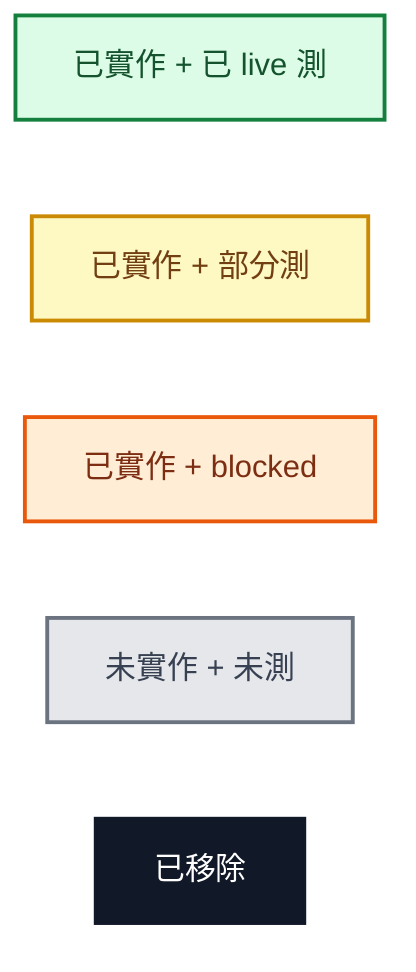
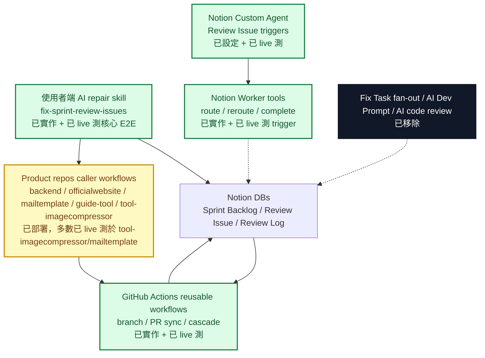
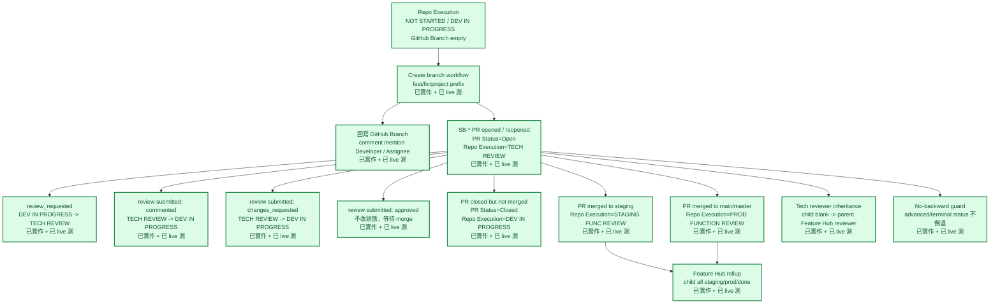
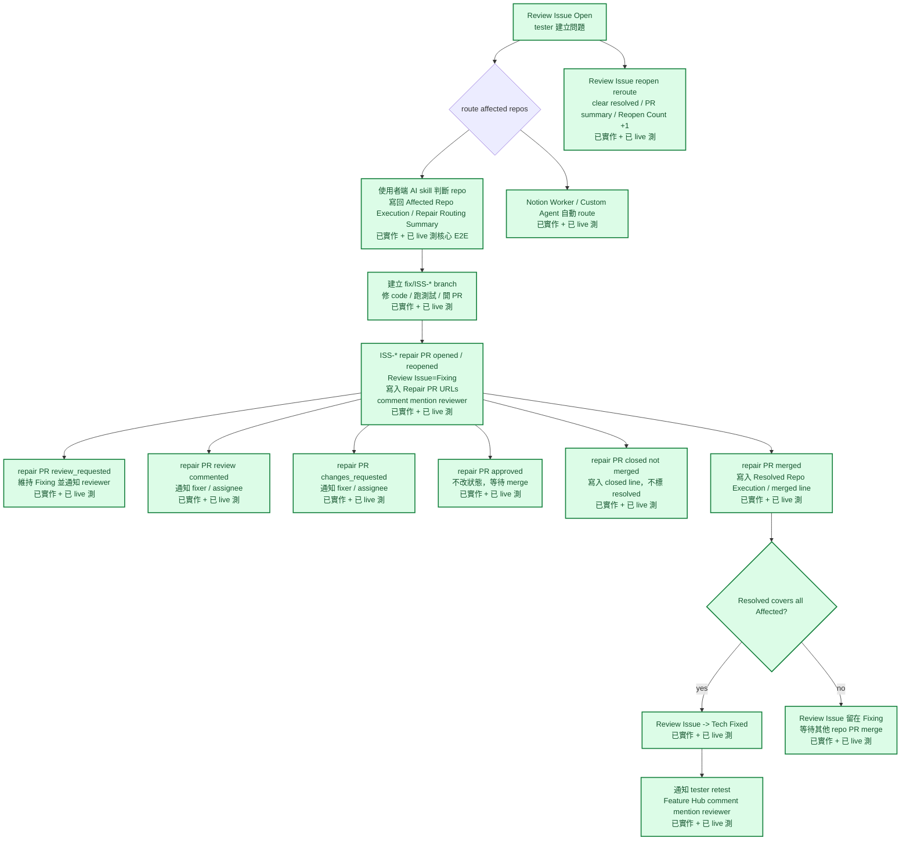
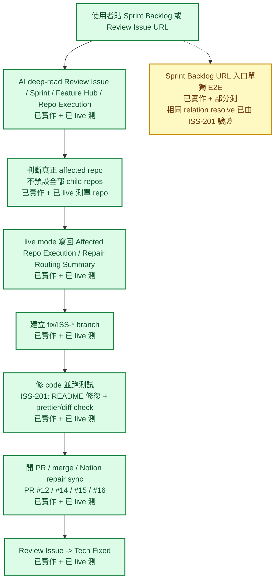
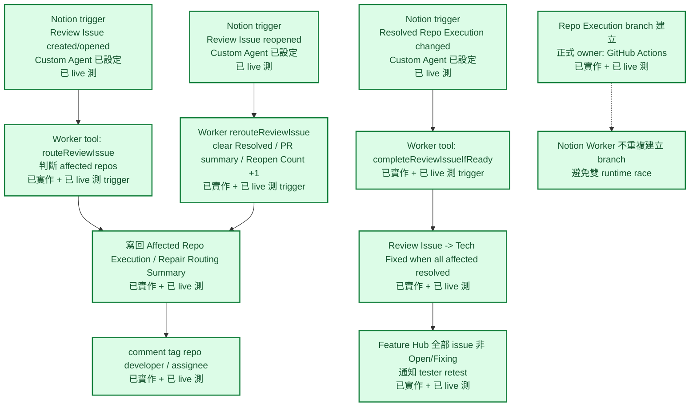
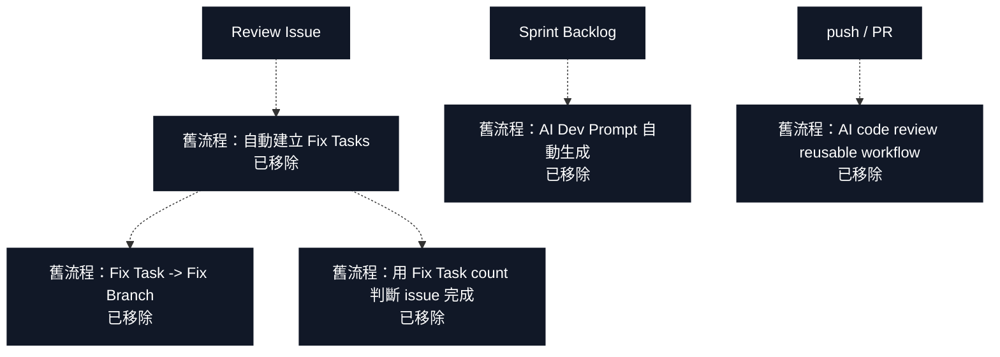

# Notion 自動化 Flow Map

最後更新：2026-05-25 17:30 Asia/Taipei

這份文件用圖像化方式呈現目前 Notion / GitHub / AI repair 自動化流程，並標註每個節點的實作與測試狀態。

Source of truth：

- 測試盤點：[docs/notion-automation-flow-test-status.md](./notion-automation-flow-test-status.md)
- 進度儀表板：[progress.html](../progress.html)

## 狀態圖例

| 標籤 | 意義 |
| --- | --- |
| `已實作 + 已 live 測` | 已部署或可執行，並用真實 Notion / GitHub side effect 驗證過。 |
| `已實作 + 部分測` | 主流程已跑過，但仍有分支事件或真人 reviewer path 未補完。 |
| `已實作 + blocked` | 程式存在，但目前需要外部條件才能測，例如非 PR author 的真人 GitHub review。 |
| `未實作 + 未測` | 目前只是目標架構或待做 runtime，還沒有可測執行面。 |
| `已移除` | 舊流程已退出 active path。 |

## 1. 整體 Runtime Ownership

目前正式 live runtime 是混合架構：GitHub Actions 負責 branch / PR sync / cascade；Notion Worker + Custom Agent 負責 Review Issue 的 Notion-side routing / reroute / completion / retest 通知。

## 2. Repo Execution 開發 Flow

這條 flow 處理 `SB-*` branch / PR 與 Sprint Backlog `Repo Execution` 狀態同步。

Repo Execution reviewer submitted path 已完成。PR #10 的 `commented` / `changes_requested` / `approved` review 都已驗證。

## 3. Feature Hub Rollup / Cascade Flow

這條 flow 處理 `Feature Hub` 與 child `Repo Execution` 的上下游狀態同步。

```mermaid
flowchart TD
  childStaging["所有 child Repo Execution<br/>達 STAGING FUNC REVIEW"] --> hubStaging["Feature Hub -> STAGING FUNC REVIEW<br/>已實作 + 已 live 測"]
  childProd["所有 child Repo Execution<br/>達 PROD FUNCTION REVIEW"] --> hubProd["Feature Hub -> PROD FUNCTION REVIEW<br/>已實作 + 已 live 測"]
  childDoneRollup["所有 child Repo Execution<br/>達 DONE"] --> hubDoneRollup["Feature Hub -> DONE rollup<br/>已實作 + 已 live 測"]

  hubFailed["Feature Hub -> FUNC REVIEW FAILED"] --> childRollback["全部 child Repo Execution -> DEV IN PROGRESS<br/>comment mention Developer / Assignee<br/>已實作 + 已 live 測"]
  hubFailed --> hubRollback["Feature Hub 自身 -> DEV IN PROGRESS<br/>已實作 + 已 live 測"]
  hubDone["Feature Hub -> DONE"] --> childDone["全部 child Repo Execution -> DONE<br/>已實作 + 已 live 測"]
  hubAbandoned["Feature Hub -> ABANDONED"] --> childAbandoned["全部 child Repo Execution -> ABANDONED<br/>已實作 + 已 live 測"]
  repoFuncFailed["單張 Repo Execution -> FUNC REVIEW FAILED"] --> repoRollback["該 Repo Execution -> DEV IN PROGRESS<br/>comment mention Developer / Assignee<br/>已實作 + 已 live 測"]

  classDef done fill:#dcfce7,stroke:#15803d,color:#14532d,stroke-width:2px
  class childStaging,hubStaging,childProd,hubProd,childDoneRollup,hubDoneRollup,hubFailed,childRollback,hubRollback,hubDone,childDone,hubAbandoned,childAbandoned,repoFuncFailed,repoRollback done
```

## 4. Review Issue Repair Flow

這條 flow 是新模型核心：`Review Issue` 直接承接修復，不再建立 `Fix Task`。

Review Issue repair reviewer submitted path 已完成。PR #11 的 `approved` 與 `changes_requested` 都已由 Zeal Lin 真人 review 驗證；`commented` 由 Gemini Code Assist 的真實 `pull_request_review COMMENTED` 驗證。

## 5. 使用者端 AI Repair Skill Flow

這條 flow 是「使用者把 Notion issue 貼給 AI，AI 自己判斷 repo 並開 PR 修復」的操作方式。

## 6. Notion Worker / Agent Flow

Worker tools 已在 repo 中實作，並由 Notion Custom Agent `Artogo Review Issue Router` 觸發過真實 Notion side effect。`ISS-209` 覆蓋 route / complete / reroute；`ISS-210` 覆蓋 Feature Hub retest notification。

## 7. 已移除 Legacy Flow

## 8. 狀態矩陣

| 範圍 | 實作狀態 | 測試狀態 | 目前結論 |
| --- | --- | --- | --- |
| Live schema：Review Issue repair 欄位 | 已實作 | 已 live 測 | 可用。 |
| 移除 Fix Tasks relation / AI Dev Prompt | 已實作 | 已 live schema 驗證 | active model 不再依賴舊欄位。 |
| Repo Execution branch 建立 | 已實作 | 已 live 測 | 可用。 |
| branch prefix `feat/fix/project` | 已實作 | 已 live 測 | 可用。 |
| branch / PR / cascade Notion mention | 已實作 | 已 live 測 | 可用。 |
| SB PR opened / closed / merge staging / merge prod | 已實作 | 已 live 測 | 可用。 |
| SB PR `review_requested` | 已實作 | 已 live 測 | 可用。 |
| SB PR review `commented` | 已實作 | 已 live 測 | Zeal Lin 在 PR #10 送出真人 `pull_request_review COMMENTED`，Notion 正確打回 `DEV IN PROGRESS` 並留言通知。 |
| SB PR review `changes_requested` | 已實作 | 已 live 測 | Zeal Lin 在 PR #10 送出真人 `pull_request_review CHANGES_REQUESTED`，Notion 正確打回 `DEV IN PROGRESS` 並留言通知。 |
| SB PR review `approved` | 已實作 | 已 live 測 | Zeal Lin 在 PR #10 送出真人 `APPROVED`，workflow log 顯示等待 merge，不改 Notion 狀態且不新增 approve-specific comment。 |
| Feature Hub rollup | 已實作 | 已 live 測 | 可用。 |
| Feature Hub `FUNC REVIEW FAILED` / `DONE` / `ABANDONED` cascade | 已實作 | 已 live 測 | 可用。 |
| Parent Feature Hub reviewer inheritance | 已實作 | 已 live 測 | 可用。 |
| Review Issue repair PR opened / closed / merged | 已實作 | 已 live 測 | 可用。 |
| Review Issue repair PR `review_requested` | 已實作 | 已 live 測 | 可用。 |
| Review Issue repair PR review `commented` | 已實作 | 已 live 測 | Gemini Code Assist 真實 `pull_request_review COMMENTED` 已觸發。 |
| Review Issue repair PR review `approved` | 已實作 | 已 live 測 | Zeal Lin 在 PR #11 送出真人 `APPROVED`，workflow log 顯示等待 merge，不改 Notion 狀態。 |
| Review Issue repair PR review `changes_requested` | 已實作 | 已 live 測 | Zeal Lin 在 PR #11 送出真人 `CHANGES_REQUESTED`，Notion `ISS-200` 維持 `Fixing` 並留言通知。 |
| Review Issue multi-repo completion | 已實作 | 已 live 測 | 可用。 |
| Review Issue terminal status guard | 已實作 | 已 live 測 | 可用。 |
| 使用者端 AI repair skill E2E | 已實作 | 已 live 測核心 E2E | 可用；Sprint URL 入口尚未單獨另跑，但 relation resolve 已由 ISS-201 覆蓋。 |
| Notion Worker route / reroute / complete tools | 已實作 | 已 live 測 trigger | `ISS-209` 由 Custom Agent 觸發 route / complete / reroute。 |
| Notion Worker retest notify | 已實作 | 已 live 測 trigger | `ISS-210` 觸發 run `019e5e74-d26d-7559-899b-ff928b674209`，`SB-2222` comment mention Zeal Lin retest。 |
| Notion Custom Agent triggers / access | 已完成 | 已 live 測 | `Artogo Review Issue Router` 已掛 Review Issue / Sprint Backlog 與 Worker tools。 |
| Worker `create_execution_branch` | 非 active path | 不適用 | branch 建立由 GitHub Actions 正式承接且已 live 測；Worker 不重複建立 branch，避免雙 runtime race。 |
| Fix Task fan-out / Fix Branch / Fix Task completion | 已移除 | 不適用 | 不再是 active path。 |
| AI code review reusable workflow | 已移除 | 不適用 | 不再由 push / PR 觸發。 |

## 9. 下一步 Gate

1. GitHub Actions / 使用者端 AI repair skill / Notion Worker + Custom Agent 的 active path 已完成 live 測試。
2. `Repo Execution` branch 建立維持 GitHub Actions owner，不遷移到 Worker，避免同一張卡被兩個 runtime 同時建立 branch。
3. 後續只剩維運項目：觀察 Notion trigger latency、清理測試卡或依實際團隊使用回饋調整 comment 文案。
