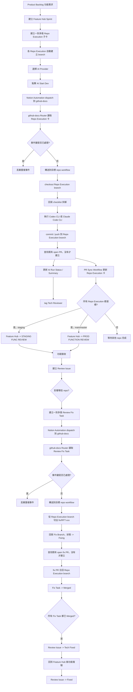

# Notion x GitHub 自動化流程規劃

最後更新：2026-03-26

## 目標
- 修正目前 `Sprint Backlog -> Branch`、`PR -> Notion` 流程與現行 Notion schema 的漂移。
- 讓 `Review Issue` 能拆成 repo 級 `Review Fix Task`，並由 fix task 自動從對應 `Repo Execution` branch 切出修復分支、追蹤自己的修復 PR。
- 讓 `Sprint Backlog` 能透過 Notion 按鈕觸發 AI 自動拆解、開發、push、開 PR、通知 reviewer。
- 保持 `github-docs` 是共用流程與路由中心，不把它變成實際產品 repo。
- 盤點現有 Notion / GitHub Actions 架構，明確界定多 repo 需求的正式處理方式。

## 核心決策

### 1. `github-docs` 的角色
- `github-docs` 只負責共用 workflow、中央 router、共用腳本與規範文件。
- 真正的產品程式碼 checkout、AI 開發、commit、push、開 PR，都在各自的產品 repo 執行。
- 如果未來採用 shared self-hosted runner，那是共用執行環境，不代表執行責任回到 `github-docs` repo。

### 2. AI 執行方式
- 不用 `Codex app` 或 `Claude Code` 的桌面互動介面當 webhook backend。
- 改用 `Codex CLI` 或 `Claude Code CLI` 的非互動模式執行。
- `AI Provider` 由 Sprint Backlog 卡片選擇，可選 `Codex` 或 `Claude`。
- 認證不限定一定是 raw API key，但一定要是 runner 可無人值守使用的憑證。

### 3. Pull Request 策略
- `Sprint Backlog` 的 AI 開發流程完成後，自動建立或更新 Sprint PR，不再保留「人工開 PR」。
- `Review Fix Task` 修復完成後，自動建立或更新 fix PR，目標 branch 固定是對應的 `Repo Execution` branch。
- Sprint 主 PR 才能往 `staging` / `main` / `master` 推進。
- Review fix PR 不能直接進 `staging` / `main` / `master`，避免修復線與主功能線脫鉤。

### 4. Merge 狀態映射
- merge 到 `staging_review_branches` 命中的 branch：`STAGING FUNC REVIEW`
- merge 到 `prod_review_branches` 命中的 branch：`PROD FUNCTION REVIEW`
- 初始預設：
  - `staging_review_branches`: `staging`
  - `prod_review_branches`: `main,master`
- 實際值由各產品 repo 的 caller workflow 自行設定。

### 5. 工作模型收斂
- 工程型工作全面收斂到 `Sprint Backlog + Review Log + Review Issue + Review Fix Task` 模型。
- 一個 `Product Backlog` item 可以對應一張 `Feature Hub` Sprint 卡，以及多張 repo 級 `Repo Execution` Sprint 卡。
- 舊有「依階段拆成多張 Sprint 單」模式不再作為工程開發主流程，也不得再接 AI 開發、branch 自動建立、PR 自動化。
- 若因營運、PM 驗收或跨部門協作需要保留額外卡片，該類卡片只能作為管理與驗收用途，不參與 repo automation。
- 自動化判定以 `GitHub Repo` 是否存在為第一條件；沒有 repo 的卡片一律視為非工程單。
- 目前 `Sprint Backlog` 的 `Parent item / Sub-item` 已被實際用於階段拆分，因此不得直接拿來重定義為 repo 路由單位。

### 6. Automation Log 強制落地
- 不再只作為建議，正式要求新增 `Automation Log`。
- 所有 router、AI 開發、branch 建立、PR 建立或更新、同步失敗，都必須寫入一筆 automation 紀錄。
- 若短期內來不及建立獨立 database，至少必須先以固定格式 comment 寫回原卡片；但正式版仍以 `Automation Log` database 為目標。

### 7. Idempotency 為正式規格
- idempotency 不再是補充建議，而是每一條 automation 的必要條件。
- 同一張 Sprint 卡不能重複送出同一個 AI run。
- 同一張 `Review Fix Task` 不能在同一個修復循環內重複建立 branch。
- 同一個 `head branch + base branch` 不能重複建立多個 open PR。
- 同一個 router 事件不能因重送、重放或重試而被重複執行副作用。

## 整體架構

### A. `github-docs` 中央管理
- 存放 reusable workflows。
- 新增中央 router workflow，接收 Notion automation 送來的 dispatch / webhook。
- 根據 Notion page 資訊判斷目標 repo、目標 branch、AI provider、PR base branch。
- 將事件轉送到目標產品 repo 的 caller workflow。

### B. 各產品 repo
- 保留 caller workflow 模式。
- 實際 checkout 該 repo branch。
- 執行 `codex exec` 或 `claude -p`。
- commit / push / 開 PR / 更新 PR body。

### C. Notion
- 只作為流程來源與狀態真相。
- 不把 repo 規則硬塞回 Notion schema。
- 只存需要營運與協作可見的欄位與狀態。

### D. 單一事件來源與去重原則
- `Sprint AI` 的唯一外部事件來源，只能是 `AI Run Requested` 這個欄位的 Notion database automation。
- `Review Fix` 的唯一外部事件來源，只能是 `Review Fix Task` 建立或進入 `Open` 狀態時的 Notion database automation。
- repo workflows 不得反向再送同型 dispatch，只能更新 Notion 狀態與欄位。
- router 只接受來自這兩條 automation 的事件，並使用事件 ID 去重。
- router 與各 repo caller 的所有副作用步驟，都必須先查既有紀錄再決定是 update 還是 create。

## 現況架構研究

### 1. Product Backlog 與 Sprint Backlog
- `Product Backlog` 目前是需求上層，一個 product item 會關聯多張 `Sprint Backlog` 卡。
- 這一層目前已經自然承接「同一個需求拆成多個工程執行單位」的能力。

### 2. Sprint Backlog 的 parent / child 實際語意
- `Sprint Backlog` 的 `Parent item / Sub-item` 目前主要被用來做「階段拆分」或「同一張 Sprint 卡內的 stage child」。
- 目前沒有足夠證據顯示 child item 已被穩定用作「不同 repo 的執行卡」。
- 因此現行 child item 結構不應直接視為多 repo 路由模型。

### 3. Repo、Branch、Reviewer 與狀態欄位掛載位置
- `GitHub Repo`、`GitHub Branch`、`GitHub PR`、`PR Status`、`Tech Reviewer`、`Func. Reviewer` 目前都是直接掛在 `Sprint Backlog` 卡本身。
- 這些欄位不是從 child item rollup，也不是由 parent item 繼承。
- 現況代表自動化真正操作的單位是「單張 Sprint 卡」，不是 parent-child 組。

### 4. Review Log / Review Issue 的實際關聯中心
- `Review Log` 與 `Review Issue` 目前都是 relation 到 `Sprint Backlog` 卡。
- 實際運作上，review 流程是圍繞 Sprint 父卡展開，而不是掛在 stage child 卡上。
- 這代表如果要支援多 repo，功能級 `Review Issue` 應繼續掛在功能中心卡，而 repo 路由要下放到新的 `Review Fix Task`。

### 5. 現有 GitHub Actions 的隱含假設
- branch workflow 目前以 `GitHub Repo = repo_name` 與 `GitHub Branch is empty` 直接查 Sprint 卡，並回寫同一張卡的 `GitHub Branch`。
- PR sync workflow 目前只從 branch 名稱擷取 `SB-xxxx`，再用 `Task ID` 找到唯一一張 Sprint 卡。
- 也就是說，現有自動化的核心假設是：
  - 一條 branch 對一張 PR
  - 一張 PR 對一個 `SB-xxxx`
  - 一個 `SB-xxxx` 對一張 Sprint 卡
- 在這個假設下，現有流程天然偏向「一張 Sprint 卡只對應一個 repo」。

## 相容性改造表

| 元件 | 現況 | 可否沿用 | 必要改造 |
| --- | --- | --- | --- |
| `Product Backlog` | 已承接需求母體，並關聯多張 Sprint 卡 | 可直接沿用 | 維持為需求母體，不承接 repo 自動化 |
| `Sprint Backlog` | 已存在、且同時承接工程與管理卡 | 可沿用 | 新增 `Card Type`，明確區分 `Feature Hub` / `Repo Execution` / `Stage/Admin` |
| `Parent item / Sub-item` | 目前多用於階段拆分 | 可沿用 | 往後正式改成 `Feature Hub` 父卡可掛 `Repo Execution` 子卡；`Stage/Admin` 子卡保留人工用途 |
| `Review Log` | 目前 relation 到 Sprint 卡 | 可沿用 | 關聯目標收斂為 `Feature Hub`，不直接掛 repo execution 卡 |
| `Review Issue` | 目前 relation 到 Sprint 卡 | 可沿用 | 關聯目標收斂為 `Feature Hub`，不直接承載 repo branch / PR |
| branch 建立 reusable workflow | 已能從 Sprint 卡建立 branch | 可沿用骨架 | 只處理 `Repo Execution` 卡，並修正 schema 漂移 |
| PR sync reusable workflow | 已能從 branch 名稱回寫 Sprint 卡 | 可沿用骨架 | 只更新 `Repo Execution` 卡，並把結果 rollup 到 `Feature Hub` |
| 功能級修復流程 | 目前只有 `Review Issue`，沒有 repo 級修復承接層 | 不足 | 新增 `Review Fix Task` database，承接每個 repo 的 fix branch / PR |

## 多 Repo 正式處理方式

### 1. 正式分層
- `Product Backlog`：需求母體。
- `Sprint Backlog / Card Type = Feature Hub`：功能級 review 與總進度中心。
- `Sprint Backlog / Card Type = Repo Execution`：每個 repo 一張執行卡，負責 branch、PR、AI 開發。
- `Sprint Backlog / Card Type = Stage/Admin`：保留給管理與驗收，不進入 repo automation。
- `Review Issue`：功能級問題單，掛在 `Feature Hub`。
- `Review Fix Task`：repo 級修復單，掛在 `Review Issue` 之下，對應到單一 `Repo Execution`。

### 2. 為什麼這樣最相容現況
- 目前 `Review Log` / `Review Issue` 已經是掛 Sprint 卡，而不是掛 Product Backlog。
- 因此最小改造不是把 review 拉到別的 database，而是在 `Sprint Backlog` 內定義一種 `Feature Hub` 卡，讓功能級 review 繼續掛在 Sprint 層。
- 同時保留 `Repo Execution` 子卡來承接 repo 自動化，這樣既能符合「review 看功能」，又不會破壞目前 workflow 依賴的「一張卡一個 repo」假設。

### 3. Sprint 卡的正式規則
- 每個跨 repo 功能，應建立一張 `Feature Hub` 卡。
- 每個需要動到的 repo，必須各自建立一張 `Repo Execution` 子卡，掛在該 `Feature Hub` 之下。
- `Repo Execution` 卡必須有自己的 `Task ID`，branch naming 與 PR sync 只使用該卡自己的 `Task ID`。
- `Feature Hub` 不直接持有 `GitHub Repo`、`GitHub Branch`、`GitHub PR`，而是透過子卡 rollup 看總體狀態。
- 舊有 `Stage/Admin` child 卡若仍需保留，只能做人工作業，不能觸發 branch、AI、PR automation。

### 4. Review 的正式規則
- `Review Log` 與 `Review Issue` 的單位是功能，因此都必須關聯到 `Feature Hub`。
- 一張 `Review Issue` 可以同時影響多個 repo，但它本身不直接持有任何 repo 級 branch / PR。
- 若某張 `Review Issue` 影響多個 repo，必須拆成多張 `Review Fix Task`，每張 fix task 只對應一個 repo。
- 所有 repo fix task 都 merge 完後，該 `Review Issue` 才能進入 `Tech Fixed`，再由 reviewer 做功能複驗。

## Notion 資料庫調整

### Sprint Backlog
新增欄位：
- `Card Type`
- `AI Provider`
- `AI Run Requested`
- `AI Run Status`
- `AI Run ID`
- `AI Last Routed Event ID`
- `AI Requested At`
- `AI Last Commit SHA`
- `AI Summary`
- `AI Start Dev` button

保留並修正使用的欄位：
- `GitHub Repo`
- `GitHub Branch`
- `GitHub PR`
- `PR Status`
- `Tech Reviewer`
- `Func. Reviewer`

卡片規則：
- `Feature Hub`
  - 功能級 review 中心。
  - 可作為 `Repo Execution` 的 parent。
  - 不直接承接 repo branch / PR automation。
- `Repo Execution`
  - 必須填一個且僅一個 `GitHub Repo`。
  - 只能掛在 `Feature Hub` 之下，或在單 repo 功能時直接視為 leaf execution card。
  - 才允許觸發 AI 開發、自動建 branch、自動建 PR。
- `Stage/Admin`
  - 只作管理與驗收。
  - 不得進入 repo automation。

### Review Issue Database
保留核心結構：
- `Sprint Backlog` relation

新增欄位：
- `Issue Opened At`
- `Issue Last Routed Event ID`
- `Fix Task Count`
- `Open Fix Task Count`
- `Merged Fix Task Count`

正式規則：
- `Sprint Backlog` relation 的目標必須是 `Feature Hub`。
- `Review Issue` 不再持有 `Issue Branch`、`Issue PR`、`Issue PR Status`。
- `Review Issue` 只描述功能問題與驗證結果，不直接承接 repo 級修復資訊。

### Review Fix Task Database
新增欄位：
- `Fix Task ID`
- `Review Issue`
- `Repo Execution Sprint`
- `Fix Branch`
- `Fix PR`
- `Fix PR Status`
- `Fix Opened At`
- `Fix Last Routed Event ID`
- `GitHub Repo (rollup)`
- `Parent GitHub Branch (rollup)`
- `Feature Hub Sprint (rollup)`

用途：
- 作為功能級 review issue 底下的 repo 級修復承接層。
- 每張 fix task 只處理一個 repo，因此可以安全建立 fix branch / fix PR。
- router 與 repo workflow 只對 `Review Fix Task` 做修復自動化，不直接對 `Review Issue` 建 branch。

### Automation Log Database
新增欄位：
- `Event Type`
- `Event Key`
- `Source Database`
- `Source Page ID`
- `Target Repo`
- `Target Branch`
- `Run ID`
- `Result`
- `Summary`
- `Related PR`
- `Triggered At`

用途：
- 作為所有自動化的正式稽核紀錄。
- router 收到事件後先查 `Event Key`，若已存在成功或進行中紀錄，直接停止重複執行。
- repo workflow 完成後回寫成功或失敗結果，供 Notion 端追查。

### Review Issue 狀態機
- `Open`：功能問題剛建立，尚未拆 fix task。
- `Fixing`：至少一張 `Review Fix Task` 已建立並進入修復中。
- `Tech Fixed`：所有相關 `Review Fix Task` 都已 merge 回各自的 `Repo Execution` branch。
- `Fixed`：reviewer 在功能複驗後確認已修復。
- `Duplicate` / `Won't Fix` / `Post-Launch` / `To Be Confirmed`：維持現有人工流程。

### Review Fix Task 狀態機
- `Open`：repo 級修復單剛建立，尚未切 branch。（Scheduler 建立時預設）
- `Fixing`：fix branch 已建立。（Branch workflow 自動設定）
- `Tech Fixed`：fix PR 已 merge，等待驗證。（PR sync workflow 自動設定）
- `Verified`：驗證通過。（人工設定）
- `Won't Fix`：不修復，觸發清理流程。（人工設定，branch workflow 自動通知刪除分支）

## 事件流程

### 1. Repo Execution 建 branch
- 只有 `Card Type = Repo Execution` 的 Sprint 卡會進入 branch automation。
- 既有 branch workflow 建立 branch。
- 修正 `任務類型` 讀法，正確建立 `feat/`、`fix/`、`project/`。
- 每張 `Repo Execution` 卡各自建立自己的 branch，不共用 branch。

### 2. AI 自動開發
- 只有 `Repo Execution` 卡能點 `AI Start Dev`。
- button 只改 `AI Run Requested`。
- Notion database automation 監聽該欄位，再送 dispatch 到 `github-docs`。
- automation 在送 dispatch 前，同步寫入 `AI Requested At`。
- `github-docs` router 讀取 Sprint 卡片，驗證：
  - `Card Type = Repo Execution`
  - `GitHub Repo`
  - `GitHub Branch`
  - `AI Provider`
- router 生成事件鍵：`{page_id}:{AI Requested At}`。
- 若事件鍵與 `AI Last Routed Event ID` 相同，直接丟棄，不再轉送。
- router 先寫入 `Automation Log`，標記事件已進入路由。
- 轉送到目標 repo caller workflow。
- 目標 repo workflow：
  - checkout `Repo Execution` branch
  - 讀取 Notion 需求內容
  - 先在該 `Repo Execution` 卡回寫 checklist 式拆解
  - 執行 AI 開發
  - commit / push
  - 依 `head branch + base branch` 查找既有 open PR
  - 若已存在則更新既有 PR
  - 若不存在才建立新的 PR
  - 回寫 `AI Run Status`、`AI Last Commit SHA`、`AI Summary`
  - 回寫 `AI Run ID` 與 `AI Last Routed Event ID`
  - 在卡片 tag `Tech Reviewer`
  - 若 `Tech Reviewer` 空白，回退 tag `指派給`
  - 同步更新 `Automation Log`

### 3. Repo Execution PR 同步
- PR opened / reopened：
  - 更新 `GitHub PR`
  - `PR Status = Open`
  - `任務狀態` 與通知不在此步直接決定，改由 AI review workflow 依 review 結果決定
    - clean pass（Human Review）→ `TECH REVIEW` + tag `Tech Reviewer`
    - agreed findings → `DEV IN PROGRESS` + tag `指派給`
    - disputed-only（Human Review）→ `TECH REVIEW` + tag `Tech Reviewer`
- PR review commented / changes requested：
  - `任務狀態 = DEV IN PROGRESS`
  - tag `指派給`
- PR merged：
  - 若 base branch 命中 `staging_review_branches`，標示該 `Repo Execution` 已進入 staging review stage
  - 若 base branch 命中 `prod_review_branches`，標示該 `Repo Execution` 已進入 prod review stage
  - 未命中則只更新 PR 狀態，不推進功能驗收
- `Feature Hub` 的 `STAGING FUNC REVIEW` / `PROD FUNCTION REVIEW`，由其底下所有 `Repo Execution` 子卡是否都達到對應條件來決定。

### 4. 功能驗收與 Review Issue
- reviewer 以 `Feature Hub` 為單位做功能驗收。
- `Review Log` 建立在 `Feature Hub` 上。
- `Review Issue` 也建立在 `Feature Hub` 上。
- 若 issue 影響多個 repo，不在 `Review Issue` 本身建立 branch，而是建立多張 `Review Fix Task`。

### 5. Review Fix Task 修復
- 新建 `Review Fix Task` 時，如果：
  - 關聯 `Review Issue`
  - 關聯 `Repo Execution Sprint`
  - `狀態 = Open`
  - `Fix Branch` 為空
- Notion automation dispatch 到 `github-docs`
- automation 在送 dispatch 前，同步寫入 `Fix Opened At`
- router 生成事件鍵：`{fix_task_page_id}:{Fix Opened At}`
- 若 `Fix Last Routed Event ID` 已是相同值，直接丟棄
- router 先寫入 `Automation Log`
- `github-docs` router 讀取 fix task 與對應 `Repo Execution` 卡
- 轉送到目標 repo caller workflow
- 目標 repo workflow：
  - 從 `Repo Execution` 的 `GitHub Branch` 切出 `fix/RFT-{id}_{slug}`
  - 回寫 `Fix Branch`
  - 將 fix task 狀態更新為 `Fixing`
  - 依 `head branch + Repo Execution branch` 查找既有 open fix PR
  - 若已存在則更新既有 fix PR
  - 若不存在才建立新的 fix PR，base 固定為 `Repo Execution` branch
  - 回寫 `Fix PR`、`Fix PR Status`
  - 回寫 `Fix Last Routed Event ID`
  - 同步更新 `Automation Log`

### 6. Review Fix Task 合併與功能複驗
- fix PR merge → Fix Task 狀態自動更新為 `Tech Fixed`
- 當同一張 `Review Issue` 底下所有相關 Fix Task 都已 `Tech Fixed` 時，`Review Issue` 自動進入 `Tech Fixed`，通知 Func. Reviewer
- reviewer 再回到 `Feature Hub` 做功能複驗
- 複驗通過後，才將 `Review Issue` 更新為 `Fixed`（人工）

## 強制補強與治理規則
- 自本文件生效起，工程自動化流程一律以 `Sprint Backlog + Review Log + Review Issue + Review Fix Task` 為唯一正式模型。
- 同一個 `Product Backlog` item 可以有一張 `Feature Hub` Sprint 卡，以及多張 repo 專屬的 `Repo Execution` Sprint 卡。
- 舊有「依階段拆成多張 Sprint 單」若仍需保留，只能用於管理與驗收，不得觸發 branch、AI、PR 自動化。
- `Automation Log` 為正式需求，不再列為可選補強。
- idempotency 為正式需求，不再列為可選補強。
- 若任何 repo caller workflow 無法滿足上述兩項，該 repo 不得先行接入自動化。

## 實作進度

### 已完成 ✅
- 修正既有 reusable workflows 與 schema/status 漂移（Phase 0）
- Card Type 過濾：branch + PR sync 只處理 Repo Execution（Phase 1）
- Review Fix Task 完整流程：自動建立 Fix Task → fix branch → Fix PR sync → Review Issue 自動關閉（Phase 2）
- Feature Hub 支援：子卡查找、rollup（向上聚合）、cascade（向下傳播）、人員繼承（Phase 3）
- 架構強化：retry、分頁、concurrency、狀態防護、自我 review 跳過（Phase 4）
- 5 個 product repo 的 caller workflow 全部部署

### 尚未實作
- 新增 `github-docs` router workflow（AI 開發用）
- 新增各產品 repo 的 AI caller workflow
- 補齊 Sprint Backlog AI 相關欄位（AI Provider / AI Run Requested / AI Run Status 等）
- Automation Log database（已決定暫緩，先用 GitHub Actions run log）

## 流程圖

