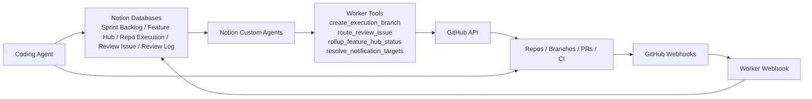
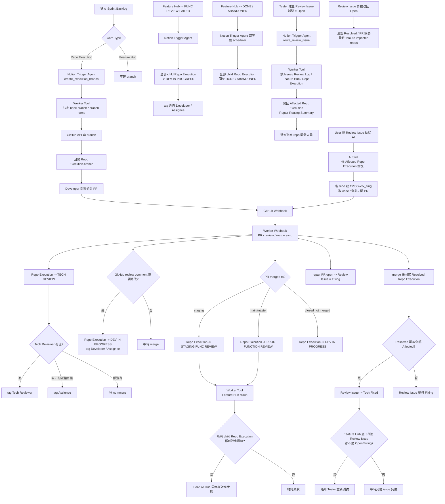
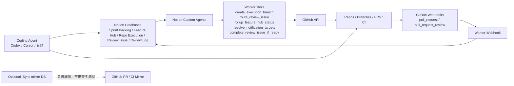

# Review Issue 直修模型 Migration Spec

Last updated: `2026-05-20`

這份文件是目前 Notion 自動化重構的最終規劃基準。

目的不是描述現況，而是定義新的正式流程，讓後續可以直接開始改：

- Notion schema
- GitHub reusable workflows
- Notion Worker / Custom Agent
- 本地 canonical skill 與 Notion skill 頁

## 1. 為什麼要改

目前的痛點不是 branch 建立本身，而是 repair scope 判斷錯了。

現況是：

- `Review Issue` 掛在 `Feature Hub`
- scheduler 會把同一個 `Feature Hub` 底下所有 `Repo Execution` 全部展開
- 每個 repo 都建立一張 `Fix Task`
- 每張 `Fix Task` 再各自建立 fix branch

結果是：

- 很多實際只影響單一 repo 的 issue，卻被強制 fan-out 成多 repo 修復流程
- 開出很多不必要的 fix branch
- 開發者事後還要手動清 branch

這份 migration 的核心目標，就是把「盲目 fan-out 全部 repo」改成「先判斷真正受影響 repo，再只修那些 repo」。

## 2. 最終決策

以下決策已經鎖定，後續實作依此為準：

1. `Fix Task` 從主流程移除。
2. `Review Issue` 固定掛在 `Feature Hub`，不直接掛 `Repo Execution`。
3. `Review Issue` reopen 後，必須重新 reroute impacted repos。
4. `Feature Hub -> FUNC REVIEW FAILED` 時，全部 child `Repo Execution` rollback 到 `DEV IN PROGRESS`。
5. `DONE / ABANDONED` 的 Feature Hub downward cascade 保留。
6. `review_requested -> TECH REVIEW` 保留。
7. `PR closed but not merged -> DEV IN PROGRESS` 保留。
8. 第一版通知只用 Notion comment / mention，不接 Slack。
9. `GitHub review comment` 是 review failed / 需要修改的正式事件來源，無論是 reviewer、Gemini 或其他 agent。
10. `AI Dev Prompt` 與 workflow 內 Anthropic prompt / slug 依賴移除。

## 3. 新舊主模型對照

### 舊模型

- `Review Log`：review session 紀錄
- `Review Issue`：問題描述
- `Fix Task`：repo 級修復執行單位
- `Fix Branch`：由 `Fix Task` 自動建立

### 新模型

- `Review Log`：保留為 review session 紀錄
- `Review Issue`：唯一 repair entrypoint
- `Repo Execution`：保留為 repo 級開發卡片
- 不再有 `Fix Task`
- impacted repo 與完成狀態，直接記在 `Review Issue`

## 4. Notion 新能力怎麼用

這次重構不以 `Notion Sync` 為核心。

原因是目前 `Sync` 適合做外部資料 mirror，但不適合直接接管現有的 `Sprint Backlog` / `Review Issue` 正式資料庫。

這次真正的主架構應該是：

- `Notion Custom Agent`
  - 處理 Notion 內部事件
- `Notion Worker Tool`
  - 處理 deterministic 邏輯
- `Notion Worker Webhook`
  - 處理 GitHub -> Notion 回寫
- `Coding Agent / repo runtime`
  - 真正修 code、跑測試、開 PR

## 5. 新架構總覽

## 6. 需要保留的既有 live 行為

這些不是新想法，而是目前 live workflow 已經存在、且新流程應保留的行為：

### 6.1 Repo Execution PR 狀態流

- PR `opened` / `reopened` -> `TECH REVIEW`
- PR `review_requested` 且目前卡片是 `DEV IN PROGRESS` -> `TECH REVIEW`
- PR `closed` but not merged -> `DEV IN PROGRESS`
- PR merge 到 `staging` -> `STAGING FUNC REVIEW`
- PR merge 到 `main/master` -> `PROD FUNCTION REVIEW`

### 6.2 Review failed / comment 打回

- GitHub review `changes_requested` 或 `commented`
- 若目前狀態尚未進入 `STAGING FUNC REVIEW` 以上
- 則 `Repo Execution -> DEV IN PROGRESS`
- 並通知 `Developer`

### 6.3 狀態不可倒退 guard

以下狀態不應因一般 PR / review 事件被打回：

- `STAGING FUNC REVIEW`
- `PROD FUNCTION REVIEW`
- `DONE`
- `ABANDONED`
- `DEPLOY PENDING`
- `PHASED DONE`

### 6.4 Feature Hub rollup

當同一 `Feature Hub` 底下所有 child `Repo Execution` 都至少到某個驗收層級時，Hub 狀態同步往上 rollup。

第一版保留：

- `STAGING FUNC REVIEW`
- `PROD FUNCTION REVIEW`
- `DONE`

### 6.5 Reviewer inheritance

child `Repo Execution` 若 reviewer 欄位空白，可從 parent `Feature Hub` 繼承 reviewer。

### 6.6 Feature Hub downward cascade

保留兩種 downward cascade：

- `FUNC REVIEW FAILED` -> 全部 child `Repo Execution` 回 `DEV IN PROGRESS`
- `DONE / ABANDONED` -> 全部 child `Repo Execution` 同步成相同狀態

### 6.7 單張 Repo Execution 的 function review failed

如果不是整個 `Feature Hub` failed，而是單一 child `Repo Execution` 被打成 `FUNC REVIEW FAILED`，仍保留該 child 單獨 rollback 的能力。

## 7. 要移除的既有流程

以下會從正式主流程移除：

1. `Review Fix Task` database 作為 repair execution layer
2. `notion-review-fix-task-scheduler.yml` 內 Review Issue -> Fix Task 自動 fan-out
3. `Fix Task -> Fix Branch` 自動建立
4. `FIX-*` repair 命名模型
5. `AI Dev Prompt` 自動寫入
6. workflow 內 Anthropic 生成 slug / prompt 的依賴
7. 任何以 `Fix Task` 數量來判斷 `Review Issue` 是否完成的規則

## 8. 新資料模型

## 8.1 Review Issue

`Review Issue` 變成唯一的 repair 入口與完成判定中心。

### 保留欄位

- Title 欄位：live schema 目前顯示為 `展廳`；workflow 不應硬編欄位名，需以 Notion property `type=title` 動態取得
- `狀態`：Status
- `修復者`：People
- `Sprint Backlog` / `Feature Hub` relation
- `Review Log` relation

### 新增欄位

- `Affected Repo Execution`：Relation
  - 這張 issue 真正需要修的 repo execution
- `Resolved Repo Execution`：Relation
  - 已經完成 merge 修復的 repo execution
- `Repair Routing Summary`：Rich text
  - 為何判斷是這些 repo
- `Repair PR URLs`：Rich text
  - 本輪 repair PR 摘要，因為可能多 repo 多 PR
- `Last Repair Sync At`：Date
  - 最後一次由 GitHub / Worker 回寫的時間
- `Reopen Count`：Number
  - 用來追蹤反覆 reopen 的問題

### 建議移除 / 隱藏

- `🔧 Fix Tasks` relation
- 所有只為 `Fix Task` count 存在的 rollup / formula 欄位

## 8.2 Review Issue 狀態流

建議正式 enum：

- `Open`
- `Fixing`
- `Tech Fixed`
- `Verified`
- `Won't Fix`

規則：

- 建立或 reopen 時：`Open`
- 完成 routing 且至少一個 repair PR 已開始：`Fixing`
- 所有受影響 repo 都已完成 merge：`Tech Fixed`
- tester 驗證通過：`Verified`
- 明確決定不修：`Won't Fix`

## 8.3 Review Issue 完成判定

只有在以下條件成立時，`Review Issue` 才能自動變成 `Tech Fixed`：

1. `Affected Repo Execution` 不為空
2. `Affected Repo Execution` 內每一個 repo 都出現在 `Resolved Repo Execution`

這會取代現在「所有 child Fix Task 都完成」的判定方法。

## 8.4 Reopen 規則

當 `Review Issue` 之後被改回 `Open`：

1. 重新執行 repo routing
2. 覆蓋 `Affected Repo Execution`
3. 清空 `Resolved Repo Execution`
4. 重建 `Repair PR URLs`
5. `Reopen Count + 1`

理由：

- reopen 代表新的修復 cycle
- 不能把上一輪已 merge 的 repo 自動算進這一輪

## 9. 命名規則

### 9.1 正常開發 branch

保留現有 `SB-*` branch 命名模型。

### 9.2 Review Issue 修復 branch

改成：

- `fix/ISS-129_short_slug`

規則：

- issue ID 為 `Review Issue` 自身唯一 ID
- slug 用 deterministic local slugification
- 不使用 Anthropic 翻譯

### 9.3 branch base

repair branch 預設：

- 有 `staging` 就從 `staging`
- 否則從 repo default branch

## 10. 通知規則

第一版所有通知都只用 Notion comment / mention。

### 10.1 TECH REVIEW 通知

`Repo Execution -> TECH REVIEW` 時：

1. 先 tag `Tech Reviewer`
2. 若無 `Tech Reviewer`，tag `指派給`
3. 若兩者都沒有，只留 comment，不 tag

### 10.2 Review failed / comment 通知

GitHub review comment 需要修改時：

1. 先 tag `Developer`
2. 若無 `Developer`，tag `指派給`
3. 若都沒有，只留 comment

### 10.3 Feature Hub rollback 通知

`Feature Hub -> FUNC REVIEW FAILED` 時：

1. 全部 child `Repo Execution` 回 `DEV IN PROGRESS`
2. 各自通知該 child 的 `Developer`
3. 若無 `Developer`，fallback `指派給`
4. 若都沒有，只留 comment

### 10.4 Review Issue routing 通知

`Review Issue -> Open` 或 reopen 時：

1. Worker 判斷 `Affected Repo Execution`
2. 對每個受影響 repo 的開發人員留 comment / mention
3. 說明該 issue 需要其修復

## 11. 事件矩陣

| 事件 | 來源 | 動作 | 寫回目標 |
| --- | --- | --- | --- |
| 建立 `Repo Execution` 開發卡 | Notion | 建立 branch | `Repo Execution` |
| `Repo Execution` PR `opened/reopened` | GitHub webhook | `TECH REVIEW` + comment | `Repo Execution` |
| `Repo Execution` PR `review_requested` | GitHub webhook | `TECH REVIEW` + comment | `Repo Execution` |
| GitHub review comment / changes requested | GitHub webhook | `DEV IN PROGRESS` + comment | `Repo Execution` |
| PR merge 到 `staging` | GitHub webhook | `STAGING FUNC REVIEW` | `Repo Execution` |
| PR merge 到 `main/master` | GitHub webhook | `PROD FUNCTION REVIEW` | `Repo Execution` |
| PR close 未 merge | GitHub webhook | `DEV IN PROGRESS` | `Repo Execution` |
| child 狀態達標 | Worker tool | rollup parent | `Feature Hub` |
| `Feature Hub -> FUNC REVIEW FAILED` | Notion trigger | rollback 全部 child | `Feature Hub` + child `Repo Execution` |
| `Feature Hub -> DONE/ABANDONED` | Notion trigger or scheduler replacement | downward cascade | child `Repo Execution` |
| `Review Issue -> Open` | Notion trigger | repo routing + notify | `Review Issue` |
| `Review Issue -> Open` (reopen) | Notion trigger | reroute + reset repair cycle | `Review Issue` |
| repair PR `opened` | GitHub webhook | `Review Issue -> Fixing` + 寫入 PR 摘要 | `Review Issue` |
| repair PR `merged` | GitHub webhook | 更新 `Resolved Repo Execution` | `Review Issue` |
| 全部 affected repos 已 resolved | Worker tool | `Review Issue -> Tech Fixed` | `Review Issue` |
| Feature Hub 下所有 Review Issue 都不再 `Open/Fixing` | Worker tool | 通知 tester 重測 | `Feature Hub` / `Review Issue` |

## 12. 完整 User Flow

## 13. 工具 Flow

## 14. 新 skill 責任邊界

## 14.1 `fix-sprint-review-issues`

要從舊的 `Fix Task` 模型改成：

1. 直接接收 `Review Issue`
2. 深讀：
   - `Review Issue`
   - `Review Log`
   - `Feature Hub`
   - child `Repo Execution`
3. 先做 impacted repo routing
4. 將 routing 結果寫回 `Affected Repo Execution`
5. 再到對應 repo 建 `fix/ISS-*` branch 修復
6. 完成後依 PR 狀態回報驗證結果

## 14.2 `notion-product-architecture`

要改成教會 agent：

- `Review Issue` 是唯一 repair object
- `Fix Task` 已退出主流程
- repo completion 由 `Review Issue` 上的 relation 判定
- `Worker / Custom Agent / GitHub webhook` 才是新的正式自動化骨架

## 15. Workflow 改動清單

## 15.1 刪除

- `.github/workflows/notion-review-fix-task-scheduler.yml`
  - 其中 `Review Issue -> Fix Task` fan-out 要完全移除

## 15.2 重寫

- `.github/workflows/notion-pr-sync-reusable.yml`
  - 保留一般 `SB-*` 開發流程
  - 移除 `Fix Task` / `FIX-*` 分支邏輯
  - 新增 `ISS-*` repair PR 回寫規則

- `.github/workflows/notion-create-branch-reusable.yml`
  - 保留 `Repo Execution` branch auto-create
  - 保留 repo-level `FUNC REVIEW FAILED`
  - 移除 `Fix Task` branch creation
  - 移除 `AI Dev Prompt`
  - 移除 Anthropic slug / prompt 依賴

## 15.3 新增

第一版若採 Notion Worker 實作，建議新增：

- `route_review_issue`
- `create_execution_branch`
- `sync_repo_pr_event`
- `complete_review_issue_if_ready`
- `rollup_feature_hub_status`
- `cascade_feature_hub_terminal_status`

## 16. Phase 切分

## Phase 1：資料模型與 live workflow 去 Fix Task 化

1. 在 `Review Issue` 新增：
   - `Affected Repo Execution`
   - `Resolved Repo Execution`
   - `Repair Routing Summary`
   - `Repair PR URLs`
   - `Last Repair Sync At`
   - `Reopen Count`
2. 移除主流程對 `Fix Task` 的依賴
3. 刪除 `notion-review-fix-task-scheduler.yml`
4. 清掉 `Fix Task` count-based completion 規則

## Phase 2：PR 回寫與狀態機重構

1. 改 `notion-pr-sync-reusable.yml`
2. 導入 `ISS-*` repair PR sync
3. 將 `Review Issue` 完成判定改成 relation-based

## Phase 3：branch 建立與 AI prompt 清理

1. 改 `notion-create-branch-reusable.yml`
2. 移除 `AI Dev Prompt`
3. 移除 Anthropic slug translation
4. 保留正常 `SB-*` branch flow

## Phase 4：skill 同步改寫

1. 重寫本地 canonical skill
2. 再同步更新 Notion skill 頁
3. 驗證「把 Review Issue 連結貼給 AI 後能直接修」

## 17. 現在能不能開始實作

可以。

這份 spec 補齊之後，已經具備開始 Phase 1 的條件：

- 核心狀態機已定
- 保留與淘汰的 live 行為已定
- `Review Issue` 新 schema 已定
- 工具責任分工已定

後續不需要再開抽象討論，可以直接按 Phase 1 開始改 live workflow 與 schema。

## 18. 驗證清單

實作完成前至少要驗這些 case：

1. 單一 `Review Issue` 在多 repo `Feature Hub` 下，只會針對真正受影響 repo 建 repair branch
2. 多 repo issue 只對 `Affected Repo Execution` 內的 repo 開 PR
3. repair PR `opened` 會把 `Review Issue` 轉成 `Fixing`
4. repair PR `merged` 只會更新對應 repo 到 `Resolved Repo Execution`
5. 最後一個受影響 repo merge 後，`Review Issue -> Tech Fixed`
6. `Feature Hub -> FUNC REVIEW FAILED` 會 rollback 全部 child
7. `Feature Hub -> DONE / ABANDONED` 仍會 downward cascade
8. `review_requested` 會把 `Repo Execution` 正確打回 `TECH REVIEW`
9. `PR closed not merged` 會把 `Repo Execution` 回 `DEV IN PROGRESS`
10. 全 repo 搜尋不到任何 active `Fix Task` / `FIX-*` / `AI Dev Prompt` 主流程依賴
